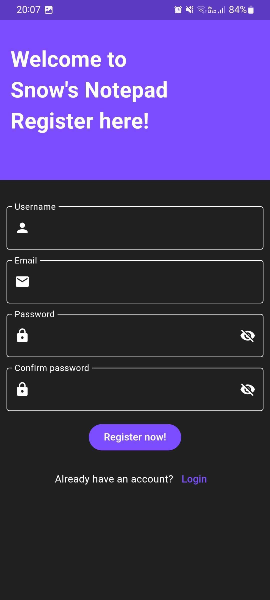
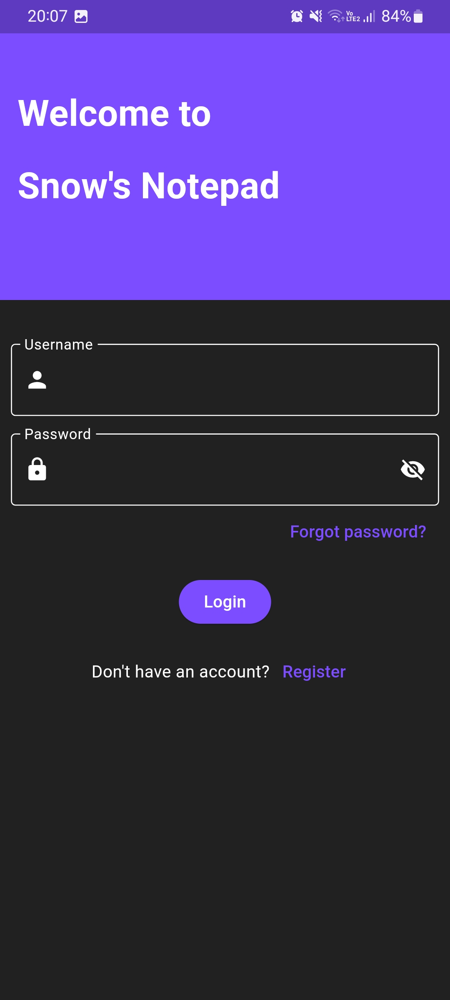
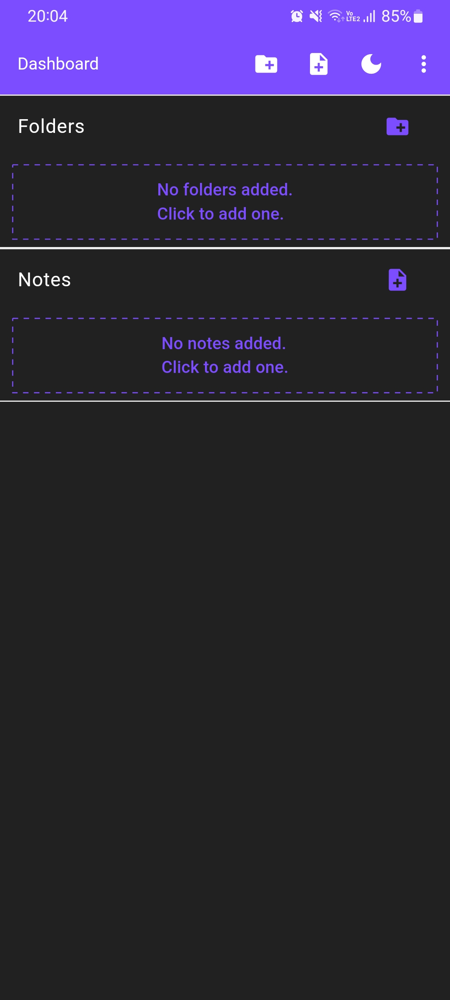
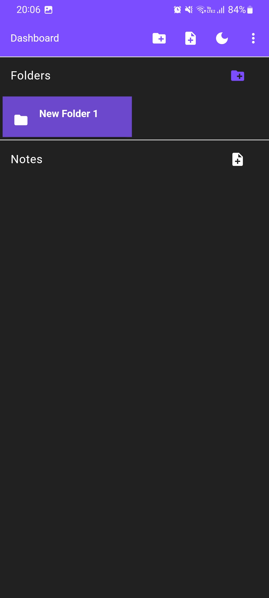
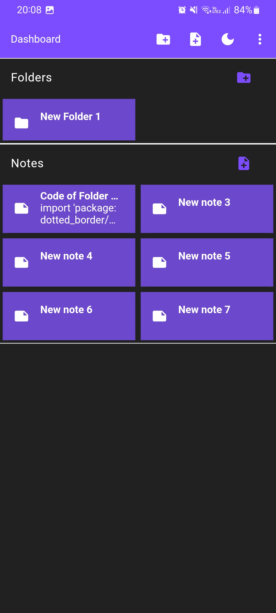
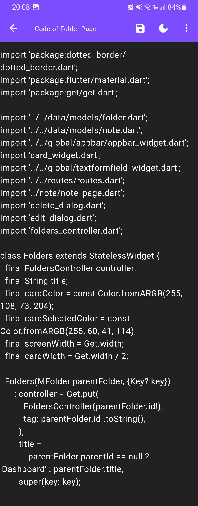
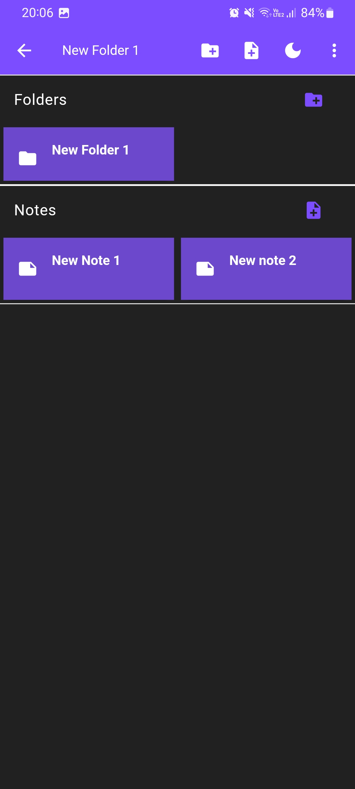
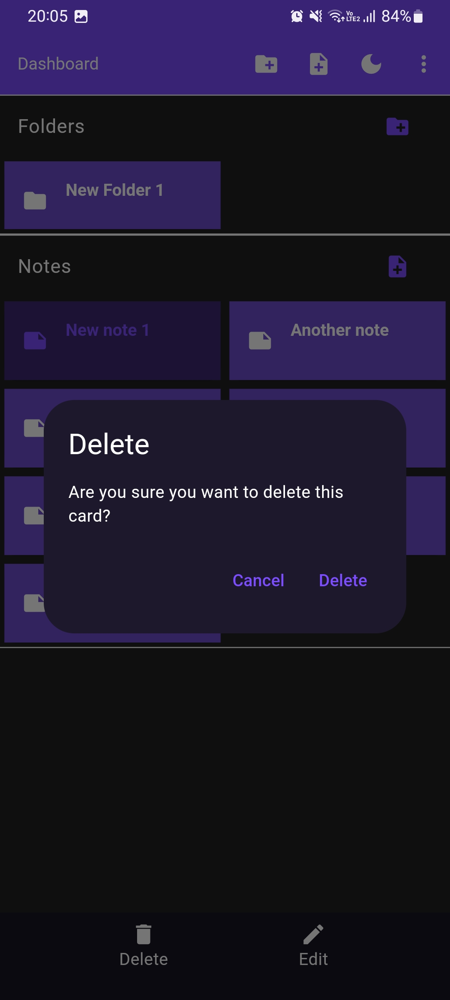
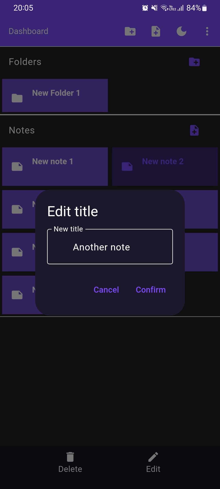
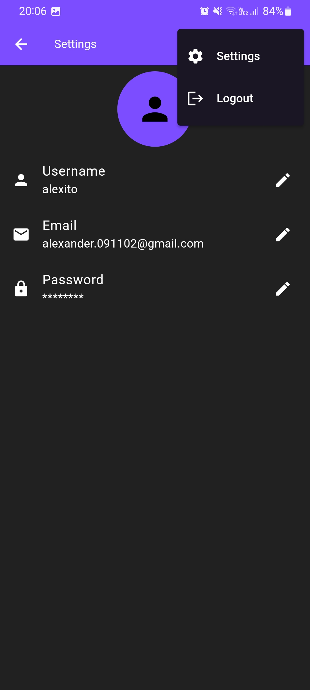

# Notepad App

## General Info

Notepad App is a prototype notepad designed for practice purposes. It uses a local database to store the notes and has a simple and intuitive interface.

**Programming Language:** Dart

**Framework:** Flutter

**Database:** SQLite

**Support:** Android

## Features

- Login and register.
- Add, edit, read and delete folders.
- Add, edit, read and delete text notes.
- All data is stored in a SQLite database.
- No internet connection required.
- No permissions required.

## Execution Instructions

Download [notepad.apk](https://github.com/AlexitoSnow/SnowNotepad/releases/download/v0.0.0/notepad.apk) and install it on your Android device.

## Status

Project is: _finished_

Will be updated with new features.

## Contact

Created by [@AlexitoSnow](https://www.linkedin.com/in/alexander-nieves/) - feel free to contact me!

## Screenshots
| Name | Description | Image |
|------|-------------|-------|
| Register page | This page allows users to register for an account. |  |
| Login page | This page allows users to log in to their account. |  |
| Empty documents | This view shows when there are no documents in a folder. |  |
| Unexpanded section | This shows a section that is not expanded. |  |
| Note card with content | This shows a note card with content. |  |
| Note with content | This shows a note with content. |  |
| Inside a folder | This shows the inside of a folder. |  |
| On long press to delete | This shows the delete action on long press. |  |
| On long press to edit | This shows the edit action on long press. |  |
| Settings page | This page allows users to access app settings. |  |
